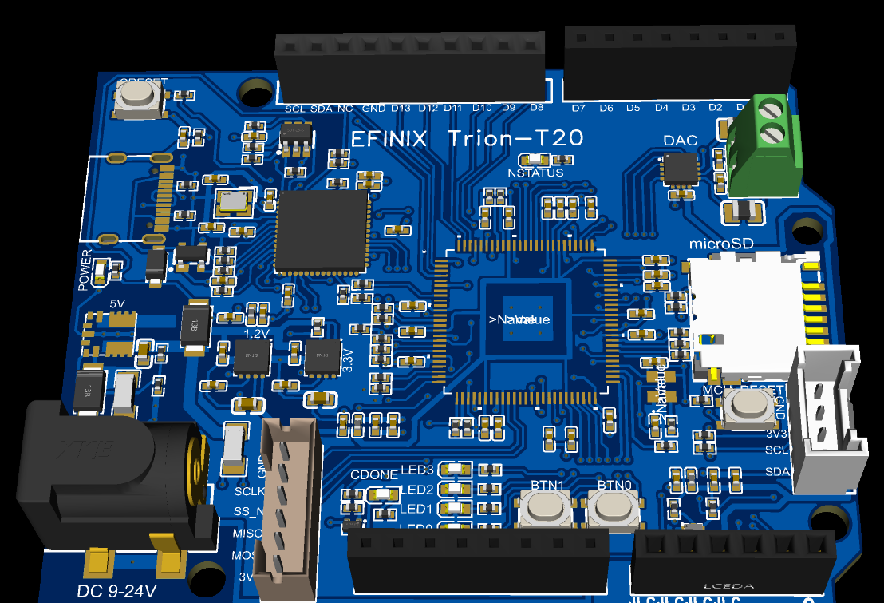

## Readme

「マイコン基板自作するネット記事はみかけるけど、FPGAの自作記事ってみかけないよね？」という話が発端で、試しにFPGA基板を作ってみました。

FPGAはEFINIX社のTrionシリーズのT20（2万LE)、基板のサイズはArduino-Uno互換というシンプルなものです。

 

  

 

まだ設計して基板制作にデータを投げたところなので、動くかどうかはわからない状態ですので、置いてあるデータはあまり信用しないでいただけるとありがたいです

 

 
